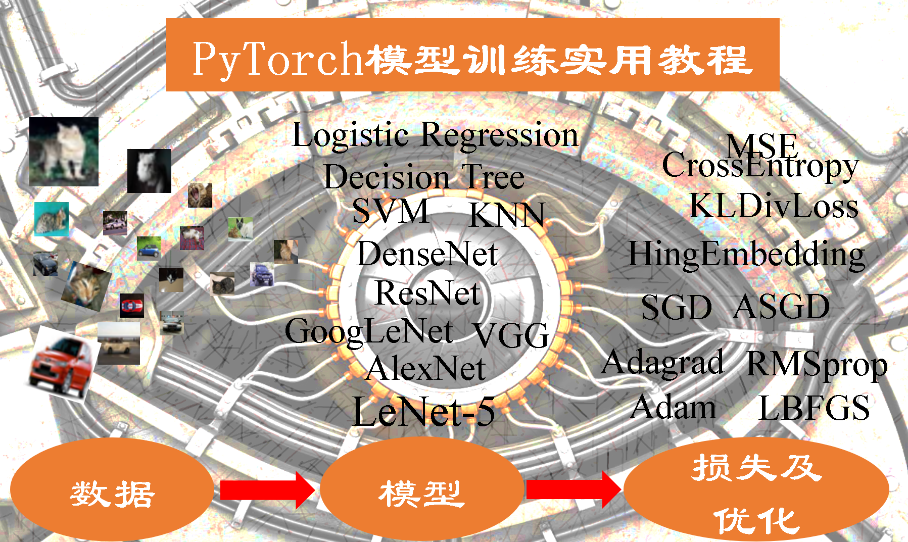

# Pytorch模型训练实用教程

---

📢：《PyTorch实用教程》（第二版）已开源，欢迎阅读：https://tingsongyu.github.io/PyTorch-Tutorial-2nd/

📢：《PyTorch实用教程》（第二版）已开源，欢迎阅读：https://tingsongyu.github.io/PyTorch-Tutorial-2nd/

📢：《PyTorch实用教程》（第二版）已开源，欢迎阅读：https://tingsongyu.github.io/PyTorch-Tutorial-2nd/

第二版新增丰富的**深度学习应用案例**和**推理部署框架**，包括CV、NLP和LLM的十多个实战项目，以及ONNX和TensorRT的教程。

# 1.简介

本代码为教程——《Pytorch模型训练实用教程》中配套代码； 
《Pytorch模型训练实用教程》可通过如下方式获取： 

1. https://github.com/tensor-yu/PyTorch_Tutorial/tree/master/Data 
2. QQ群： 四群：854620826   

# 2.环境配置
代码在以下两种环境测试过： 
1. win10 64位 + python3.5 + pytorch==0.4.0  
2. mac + python3.6 + pytorch==0.4.1/ pytorch==1.0.0  

**第一步 安装各依赖包：** 
pip install -r requirements.txt

**第二步 手动安装pytorch及torchvision：** 
均选择无gpu版本进行安装，进入官网选择相应的指令进行安装
https://pytorch.org/get-started/locally/

# 3.问题反馈
若发现任何问题和改进意见，请您随时联系我。 
联系方式：yts3221@126.com 
读者qq群：

​	一群：671103375 (已满)   

​	二群：773031536 (已满） 

​    三群：514974779 (已满） 

​    四群：854620826(已满)

​    五群：1021300804

# 4.修改记录
0.0.5：
1. 1.6小节勘误，将36\*36改为40\*40；
2. 2.3小节删除注释；
3. 修改权值初始化杂谈中的理解错误；
4. 全文代码缩进。

---

如果本教程对你有帮助😀😀，请作者喝杯茶吧🍵🍵🥂🥂

WeChat：               Alipay:

---

## Stargazers over time

